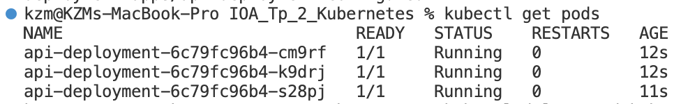
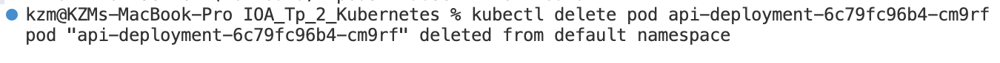
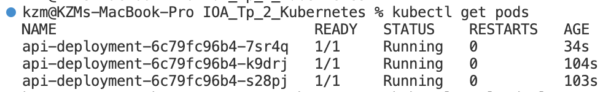
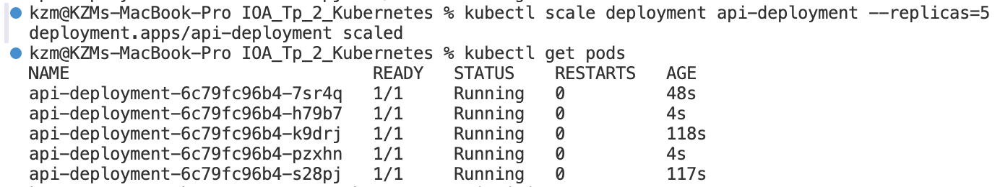

# Infrastructure Orchestration & Automation - TP Kubernetes & Docker

## Description

Ce projet met en pratique la containerisation d'un service de données (API Flask et base de données PostgreSQL) et son ordonnancement à grande échelle, en passant d'un environnement local géré par Docker Compose à un cluster Kubernetes local (Minikube).

## Prérequis

* Docker et Docker Compose installés et fonctionnels.
* Minikube et `kubectl` installés pour le cluster Kubernetes local.
* Un éditeur de texte / IDE (VS Code).

## Structure du Projet

* `api/app.py` : Code source de l'API Flask interrogeant la base de données.
* `api/Dockerfile` : Recette de containerisation pour construire l'image de l'API[cite: 3].
* `api/requirements.txt` : Dépendances Python nécessaires (Flask, psycopg2-binary).
* `api/init.sql` : Script SQL d'initialisation de la table `ventes` et d'insertion des données de test.
* `docker-compose.yaml` : Fichier d'orchestration multi-conteneurs local (API + PostgreSQL avec volume persistant)[cite: 3].
* `deployment.yaml` : Manifeste Kubernetes décrivant le déploiement de l'API avec plusieurs réplicas[cite: 3].
* `service.yaml` : Manifeste Kubernetes exposant l'API via un service de type `NodePort`[cite: 3].

## 1. Exécution locale avec Docker Compose

* **Démarrer les services** :
  ```bash
  docker compose up --build -d
  ```


* **Vérifier l'état des conteneurs** :

```bash
docker compose ps
```


* **Tester l'API** :

```bash
curl http://localhost:8000/health
curl http://localhost:8000/ventes
```


## 2. Déploiement sur un cluster Kubernetes (Minikube)

* **Démarrer Minikube** :

```bash
minikube start
```


* **Construire et charger l'image dans Minikube** :

```bash
docker build -t mon-service:1.1 ./api
minikube image load mon-service:1.1
```


* **Appliquer les manifests Kubernetes** :

```bash
kubectl apply -f deployment.yaml
kubectl apply -f service.yaml
```


* **Vérifier le déploiement et les pods** :

```bash
kubectl get deployments
kubectl get pods
kubectl get svc
```


## Résilience et Approche Déclarative

Grâce à Kubernetes, l'infrastructure est déclarative. Si un pod vient à tomber, le *Deployment* (via son  *ReplicaSet* ) détecte l'écart et recrée automatiquement une nouvelle instance pour respecter le nombre de réplicas souhaité. Le *Service* garantit quant à lui une stabilité d'accès réseau malgré les changements dynamiques d'adresses IP des pods.


* **Quelle est la différence entre une image Docker et un conteneur Docker ?**
  * Une image est le modèle figé et immuable de l'application et de son environnement.
  * Un conteneur est l'instance active en cours d'exécution de cette image.
* **Pourquoi les données de la base sont-elles perdues si l’on supprime le volume, mais pas si l’on supprime seulement le conteneur ?**
  * Le conteneur est éphémère, alors qu'un volume stocke les données en dehors du cycle de vie du conteneur, directement sur la machine hôte.
  * Supprimer le conteneur laisse le volume intact, tandis que supprimer le volume efface définitivement les données qui y étaient enregistrées.
* **Un Deployment Kubernetes déclaré avec `replicas: 3` perd un pod. Que fait Kubernetes, et pourquoi parle-t-on d’approche déclarative ?**
  * Kubernetes recrée automatiquement un nouveau pod pour s'assurer de revenir au nombre de 3 réplicas défini.
  * On parle d'approche déclarative car on décrit l'état désiré de l'infrastructure, et le système corrige de lui-même les écarts constatés avec l'état réel.
* **Quel est le rôle du Service par rapport aux pods, sachant que ces derniers sont recréés régulièrement avec une nouvelle adresse IP ?**
  * Le Service fournit une adresse réseau stable pointant vers l'ensemble des pods, masquant ainsi leurs recréations et changements d'adresses permanents.
* **Citez deux limites de Docker seul (sans Kubernetes) que vous avez observées ou apprises ce matin.**
  * Docker gère les conteneurs d'une seule machine à la fois.
  * Il ne dispose pas de mécanismes natifs pour la répartition automatique de la charge entre plusieurs instances ou la montée en charge selon la demande.












